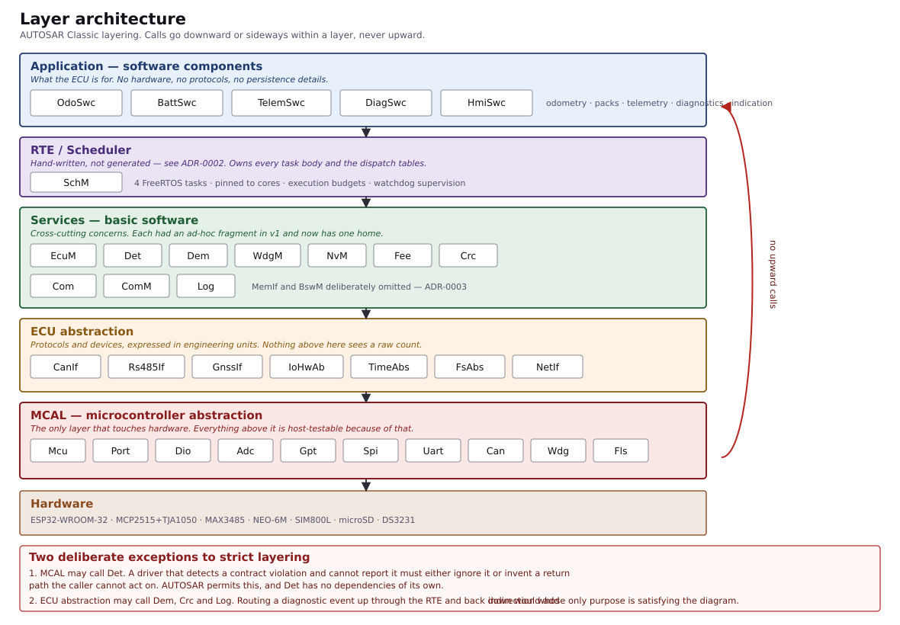
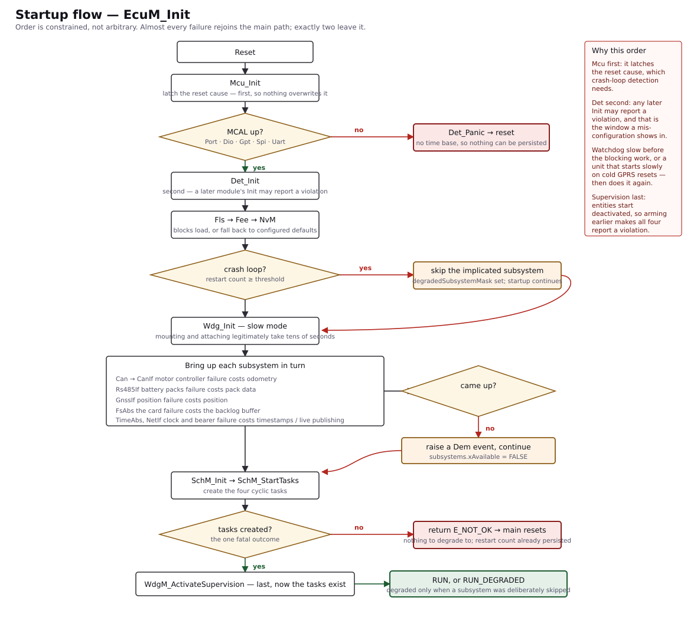
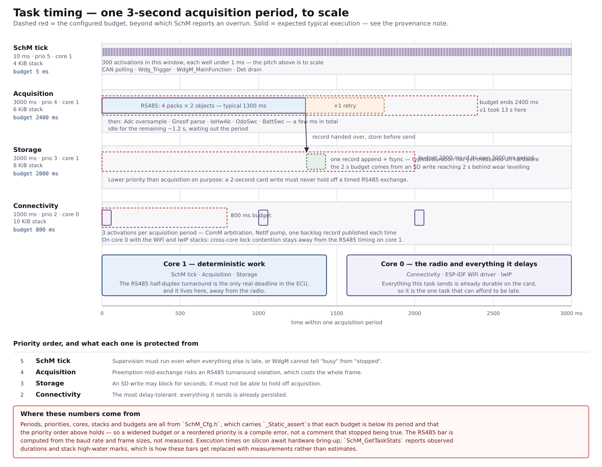
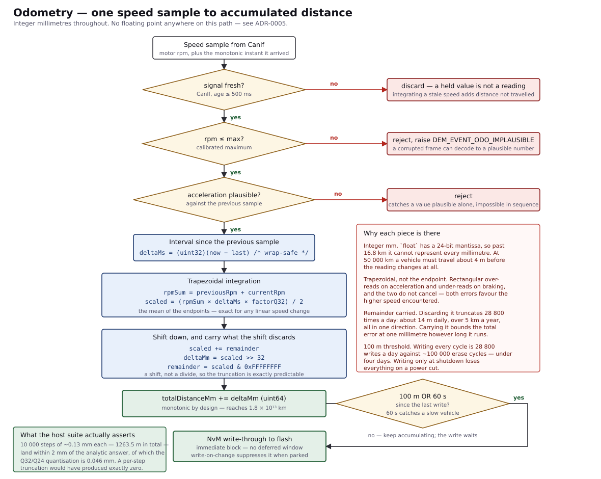
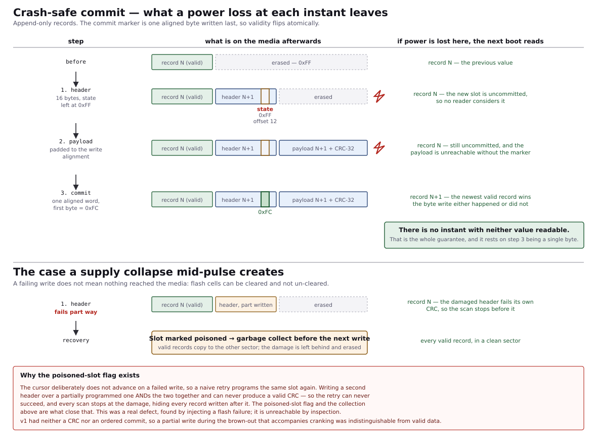
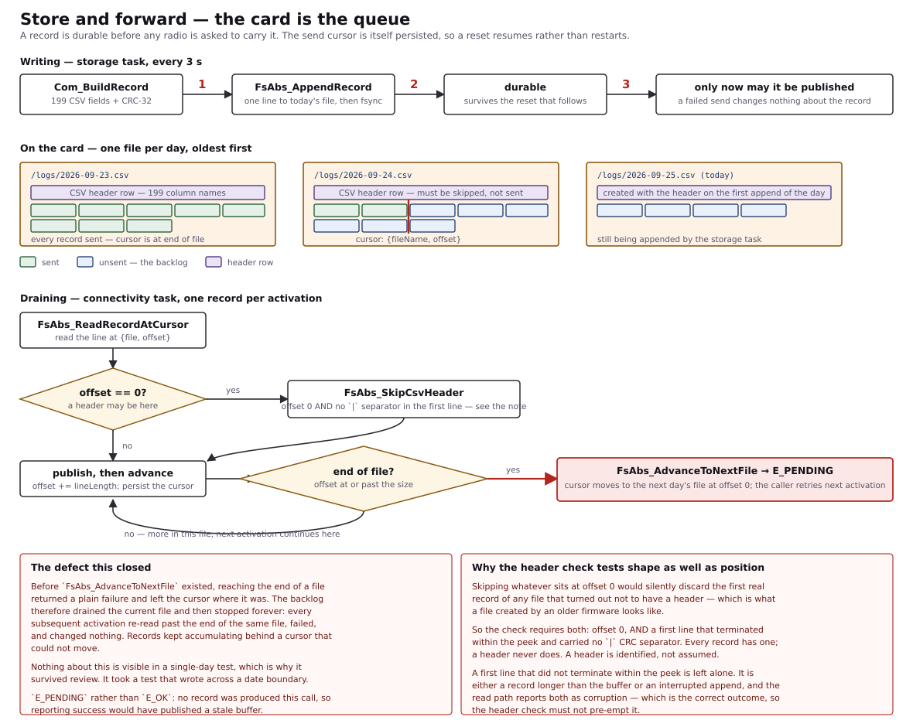
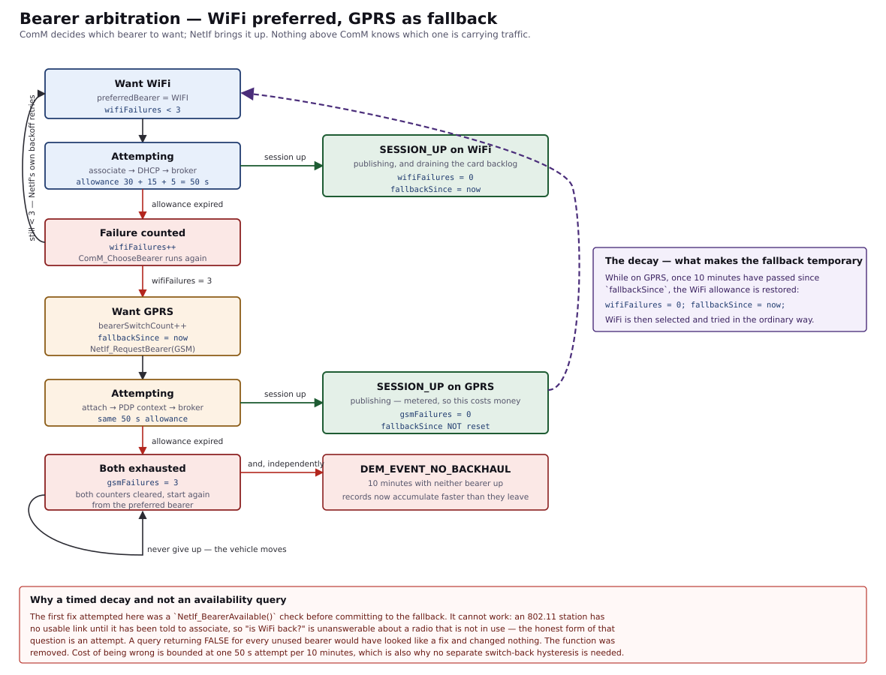

# EV Telematics &amp; Odometry ECU

Production-grade firmware for an electric-vehicle telematics and odometry control unit, built on an
ESP32 in an **AUTOSAR Classic** layered architecture — a ground-up rewrite of a version that had
already shipped, and that lost odometer readings in the field.

[](https://github.com/abdullahshabbir2/autosar-ev-telematics/actions/workflows/ci.yml)
[](test/)
[](test/)
[](docs/02-architecture.md)
[](docs/06-traceability.md)
[](LICENSE)



| | |
|---|---|
| **333** host unit tests across **16** suites | every one runs without hardware |
| **~90 %** of source compiled into the host suite | the rest is isolated in platform leaves |
| **6** CI gates | tests, build, cppcheck, format, docs, credential hygiene |
| **129** requirements | each traced to the test that verifies it |
| **18.5 %** RAM · **42.6 %** of one OTA slot | room for the second slot and growth |
| **4** defects found by tests | in code that had already been reviewed |

> **[Open the interactive walkthrough →](https://claude.ai/artifact/5XEUxs1cESrtoFYBGqMDFE)**
> Drag an odometer to see live IEEE-754 precision loss, and cut the power at any point in a flash
> write to see what the next boot reads.

---

### Contents

[What it does](#what-it-does) · [Why it was rebuilt](#why-it-was-rebuilt) ·
[Architecture](#architecture) · [Execution model](#execution-model) ·
[Engineering highlights](#engineering-highlights) · [What testing found](#what-testing-actually-found) ·
[How it is verified](#how-it-is-verified) · [Quick start](#quick-start) ·
[Documentation](#documentation) · [Status and scope](#status-and-scope)

---

## What it does

Every three seconds, the unit:

- reads motor speed, DC-link voltage and current from the motor controller over **CAN** (MCP2515)
- polls up to four battery packs over a shared **RS485** bus — pack voltages, currents, temperatures,
  state of charge, and all 23 cell voltages per pack
- reads position from a **GNSS** receiver and the auxiliary supply voltage from the ADC
- integrates motor speed into an **odometer** reading, in exact integer millimetres
- writes one 199-field CSV record to an **SD card** — and only then
- publishes that record to an **MQTT** broker over WiFi or GPRS, whichever is available
- serves historical backfill requests from the broker

It also supervises itself: a diagnostic trouble-code store that survives power cycles, per-task
watchdog supervision, and crash-loop detection that degrades rather than reboots forever.

---

## Why it was rebuilt

The predecessor was a 719-line `main.cpp` plus twelve modules that reached directly for hardware,
shared state through a `byte flags[15]` array, and allocated an Arduino `String` on every path. It
worked, mostly. The problems were not stylistic:

| Symptom | Root cause |
|---|---|
| Odometer reading silently degraded over months | Distance stored as text, read back with `atol()`, which discards the fraction. The truncated value was written straight back, so the loss compounded. |
| CAN data never arrived | `init_can()` returned `true` unconditionally with the hardware call commented out. Nothing in the system could detect it. |
| A hung task stalled the logger indefinitely | Watchdog configured but no task ever subscribed to it — the boot log read as evidence of protection that did not exist. |
| Intermittent SD failures on a healthy card | Two devices sharing one SPI bus with no arbitration. |
| A returned unit carried no diagnostic evidence | `flags[15]` was overwritten every cycle and lost on reset, so the fault recurred on the replacement. |
| Credentials in the repository | A Firebase token and WiFi password committed as string literals — permanently, since history keeps them. |

Every one of those is now either impossible or detected.
[docs/02-architecture.md](docs/02-architecture.md) has the full account with file and function names.

---

## Architecture

Five layers. Calls go downward or sideways within a layer, never upward — with two deliberate
exceptions, both recorded in [docs/03-interfaces.md](docs/03-interfaces.md) §2 and drawn in the
footer of the diagram at the top of this page.

Each hardware-touching module splits into a **pure core** (`<M>.c`, compiled on host *and* target) and
a **platform leaf** (`<M>_Esp32.cpp`, target only), with a `<M>_Platform.h` contract between them.
Roughly 90 % of the source is in the cores, where the host suite tests the real implementation rather
than a mock of it. ([ADR-0006](docs/adr/0006-pure-core-platform-leaf.md))

**That split is enforced mechanically, not by convention.** The test runner links every
`src/**/*.c` into every test binary, so a module that reaches for the platform from its pure core
fails to link — in all 16 suites at once — rather than being caught in review, or not at all.

### Startup



`EcuM_Init` returns `E_NOT_OK` for exactly one condition — a task could not be created — because that
is the only failure with nothing to degrade to. Every other subsystem failure raises a diagnostic
event and startup continues. v1 exited on any failure, which is why a vehicle with a disconnected CAN
harness rebooted forever and logged nothing at all.

---

## Execution model



| Task | Period | Prio | Core | Budget | What the priority protects it from |
|---|---|---|---|---|---|
| SchM tick | 10 ms | 5 | 1 | 5 ms | Supervision must run even when everything else is late, or `WdgM` cannot tell "busy" from "stopped" |
| Acquisition | 3000 ms | 4 | 1 | 2400 ms | Preemption mid-exchange risks an RS485 turnaround violation, which costs the whole frame |
| Storage | 3000 ms | 3 | 1 | 2000 ms | An SD write may block for seconds; it must not hold off acquisition |
| Connectivity | 1000 ms | 2 | 0 | 800 ms | The most delay-tolerant — everything it sends is already durable on the card |

Every number above is a constant in `SchM_Cfg.h` with a `_Static_assert` behind it: each budget must
be below its period, and the priority order must hold. A widened budget is a compile error rather than
a comment that stopped being true. Connectivity is pinned to core 0 with the WiFi and lwIP stacks, so
the radio's unpredictable latency stays away from the RS485 timing on core 1.

---

## Engineering highlights

### Integer-only odometry



`float` has a 24-bit mantissa, so past 16 777 km it can no longer represent every millimetre and
increments are silently discarded — at 50 000 km a vehicle must travel about **4 m** before the reading
changes at all. Distance is accumulated as `uint64` millimetres using a Q32 factor derived from a Q24 π,
trapezoidally integrated, with the sub-millimetre remainder carried between intervals.

`test_odo` accumulates 10 000 increments of about 0.13 mm each — 1263.5 m in total, every one of them
entirely fractional — and the result lands within **2 mm** of an analytic answer computed independently
of the implementation; the Q32/Q24 quantisation accounts for **0.046 mm** of that. The figure that
matters most is the floor: an implementation that truncated per step would have accumulated **exactly
zero** over that run, which is the v1 defect made measurable.
([ADR-0005](docs/adr/0005-integer-only-odometry.md))

### Crash-safe persistence



Append-only records with a separate one-byte commit marker written last, so the instant a record
becomes valid is a single byte write — and flash programming can only clear bits, so that write either
happened or it did not. A power loss at any step leaves either the old value or the new one, never a
mixture. Garbage collection commits on a sector header rather than on a copy, so there is no window in
which neither sector holds the data. Each of the four steps is individually fault-injected in
`test_fee`.

### Store and forward



The card is the queue. A record is durable before any radio is asked to carry it, and the send cursor
is itself persisted, so a reset resumes the backlog rather than restarting or skipping it. A duplicate
costs the broker one de-duplication; a gap costs a journey that no longer exists anywhere.

### Bearer arbitration



WiFi is preferred because it is free; GPRS is the fallback because it is not. The fallback decays after
ten minutes, which is what stops it becoming permanent — see [below](#what-testing-actually-found).

### Independently derived test values

Every non-obvious constant was computed by a separate model before being written into a test.
`tools/crc_reference.py` implements all six AUTOSAR CRC profiles bit-at-a-time and self-checks against
their published check values; `tools/rs485_reference.py` reproduces the predecessor's own
hardware-proven frames — and found that one of its three embedded CRCs is wrong, undetected for the
life of the product because the response validator returned `true` unconditionally.

### Hardware conflicts as build errors

`Ecu_PinMap.h` detects a double-assigned GPIO by comparing the bitwise OR of the pin bits against
their arithmetic sum. It also rejects the internal flash pins, and input-only pins used as outputs.
Three more static-assertion sets cover the schedule and the storage block sizes; the latter fired on
three under-sized blocks before any test ran.

### Shared-bus arbitration

The MCP2515 and the SD card share VSPI at different clock rates, with transaction lengths differing by
five orders of magnitude. `Spi_Lock` makes the bus an owned resource, held across a whole logical
operation — a transfer attempted without it fails, rather than working most of the time.

---

## What testing actually found

Four defects in code that had already been reviewed line by line. None are visible by reading; each
needed a test that put the system somewhere awkward to reach by hand.

| Module | Defect | Why review missed it | What found it |
|---|---|---|---|
| `NvM` | A failed flash write reported success. The block's dirty flag was cleared regardless, so `NvM_WriteImmediate` returned OK without writing and the shutdown flush skipped it — silently discarding up to 100 m of distance. | The failure path existed and returned the right code. What was missing was one line of state, invisible unless you ask what happens on the *next* cycle. | Making the flash stub fail one write, then asserting the value is still pending afterwards. |
| `Fee` | A poisoned slot no retry could clear. The cursor deliberately does not advance on a failed write, so the retry programs the same slot — and flash only clears bits, so a second header ANDed over a partial one can never produce a valid CRC. Every later record became unreachable behind the damage. | Each half is correct alone. The defect exists only in the interaction, and only after a write has already failed once. | Injecting a flash failure mid-header, then continuing to write. |
| `FsAbs` | The backlog never crossed midnight. Reaching the end of a day's file returned a plain failure and left the cursor where it was, so the backlog drained the current file and then stopped forever. Housekeeping then correctly refused to reclaim the file the stuck cursor sat on, so the card filled and appends began failing — presenting as a storage fault. | Every single-day test passes. The bug needs the clock to cross a date boundary with unsent records on both sides. | A test that writes across a rollover. Fixed by returning `E_PENDING` and advancing: "no record this call" is not the same as "failed". |
| `ComM` | The cellular fallback was permanent for the life of the run. The failure count that triggered it could only be cleared by WiFi carrying traffic — which cannot happen while WiFi is not being attempted. | Nothing looks wrong: the unit is connected and sending. It is simply paying for cellular beside a healthy access point, all day, until someone power-cycles it. | Holding WiFi down past the fallback, then bringing it back. The first fix — a `NetIf_BearerAvailable()` query — could not work either: an 802.11 station has no link until told to associate, so the honest form of that question is an attempt. Replaced with a ten-minute decay. |

---

## How it is verified

### The six CI gates

| Gate | What it enforces |
|---|---|
| Host tests | 333 tests under `-Werror` with eleven warning flags, including `-Wconversion` and `-Wsign-conversion` |
| Firmware build | The image links and fits the size budget for one OTA slot |
| Static analysis | cppcheck at `--check-level=exhaustive`, with every suppression carrying its reason |
| Formatting | clang-format checked, never applied — a job that commits back makes formatting indistinguishable from real change |
| Documentation | Doxygen with `WARN_AS_ERROR`, plus link resolution and requirement-reference checks |
| Credential hygiene | Fails if `config/Secrets.h` ever becomes tracked, or a credential macro is left at its placeholder |

Every tool version is **pinned**. Three of these gates failed on their first run purely because the
runner's distro packages had drifted from the versions the repository was validated against — a gate
whose meaning changes with the week is worse than no gate, because it trains you to ignore it.

### The suites

| Suite | Tests | Covers |
|---|---:|---|
| `test_system` | 34 | Startup order, degraded modes, shutdown |
| `test_rs485` | 28 | Frame build, parse, turnaround timing |
| `test_core` | 26 | Wrap-safe time, Det store bounds, UART discard vs drain |
| `test_net` | 24 | Bearer arbitration, link and session state |
| `test_hmi` | 22 | Indicator patterns and phase coherence |
| `test_telem` | 22 | Record assembly, store-before-send ordering |
| `test_time` | 22 | RTC, monotonic fallback, conversions |
| `test_diag` | 21 | UDS status bytes, freeze frames, healing |
| `test_sensors` | 21 | ADC trimming, per-unit calibration |
| `test_nvm` | 19 | RAM mirror, end-to-end CRC, write-on-change |
| `test_fee` | 18 | Commit ordering, garbage collection, fault injection |
| `test_odo` | 18 | Plausibility gates, integration, persistence |
| `test_com` | 17 | Serialisation bounds, transfer framing |
| `test_can` | 15 | MCP2515 registers, identifier assembly |
| `test_batt` | 14 | Pack health, cell imbalance |
| `test_crc` | 12 | All six AUTOSAR profiles against published check values |

The MCAL test doubles are written to be **faithful rather than convenient** — the WiFi stub has no link
until it is told to associate, because that is what an 802.11 station actually does. That faithfulness
is what exposed the bearer-arbitration defect above.

---

## Quick start

```bash
# Credentials (git-ignored; the template is committed)
cp config/Secrets.h.template config/Secrets.h

# Host tests — no hardware needed
python tools/run_native_tests.py

# Target firmware
pio run

# Flash (first time, or after a partition change, needs a full erase)
pio run --target erase
pio run --target upload
```

> `pio run --target erase` destroys the odometer reading — it lives in the `nvdata` partition. Read it
> first. [docs/09-operations.md](docs/09-operations.md) covers flashing, provisioning, diagnosis and
> credential rotation.

---

## Documentation

Start with [docs/README.md](docs/README.md), which says which document answers what. In reading order:

| Document | Answers |
|---|---|
| [01-requirements.md](docs/01-requirements.md) | What it must do — 129 requirements, each with its rationale |
| [02-architecture.md](docs/02-architecture.md) | How it is built, and what the predecessor got wrong |
| [diagrams/](docs/diagrams/) | The same design visually — eight SVGs, plus the dependency graph |
| [07-hardware.md](docs/07-hardware.md) | Schematic, pin map, bill of materials |
| [05-test-strategy.md](docs/05-test-strategy.md) | How the claims above are verified — and what is not covered |

Reference: [03-interfaces.md](docs/03-interfaces.md) ·
[04-safety-analysis.md](docs/04-safety-analysis.md) ·
[06-traceability.md](docs/06-traceability.md) ·
[08-protocols.md](docs/08-protocols.md) ·
[09-operations.md](docs/09-operations.md) ·
[10-coding-standard.md](docs/10-coding-standard.md)

Six decision records in [docs/adr/](docs/adr/) cover the choices a reader would otherwise have to
reverse-engineer — including the ones that deviate from AUTOSAR convention, and why:

[0001](docs/adr/0001-autosar-layering.md) layering ·
[0002](docs/adr/0002-handwritten-rte.md) hand-written RTE ·
[0003](docs/adr/0003-omit-memif.md) omitting MemIf ·
[0004](docs/adr/0004-keep-det-enabled-in-production.md) Det in production ·
[0005](docs/adr/0005-integer-only-odometry.md) integer odometry ·
[0006](docs/adr/0006-pure-core-platform-leaf.md) core/leaf split

---

## Repository layout

```
config/            Ecu_Cfg.h, Ecu_PinMap.h, Secrets.h.template
src/base/          Std_Types, Platform_Types, Compiler abstractions
src/mcal/          Hardware drivers — the only layer touching hardware
src/ecuabs/        ECU abstraction: protocol and device interfaces
src/services/      BSW: EcuM, Det, Dem, WdgM, NvM, Fee, Crc, Com, ComM, Log, SchM
src/app/           Application components: OdoSwc, BattSwc, TelemSwc, DiagSwc, HmiSwc
test/              16 suites plus the MCAL test doubles
tools/             Reference models, test runner, traceability and validation
docs/              Documentation, decision records, diagrams, schematic, BOM
partitions/        Flash partition table
scripts/           Build-time provenance injection
```

---

## Status and scope

The firmware builds, the host tests pass, and the structural claims above are enforced by the build.
What is **not** claimed:

- **Not silicon-verified end to end.** The ~10 % of source in the platform leaves is verified only on
  hardware, and hardware bring-up is the remaining step.
  [docs/05-test-strategy.md](docs/05-test-strategy.md) §7 lists each gap and what covers it instead.
- **Not a conforming AUTOSAR implementation.** It is AUTOSAR *structured*. MemIf and BswM are omitted
  and the RTE is hand-written; [ADR-0002](docs/adr/0002-handwritten-rte.md) and
  [ADR-0003](docs/adr/0003-omit-memif.md) say why.
- **Not a functional-safety item.** The unit observes and records; it actuates nothing, so no failure
  of it can affect vehicle behaviour. [docs/04-safety-analysis.md](docs/04-safety-analysis.md) states
  the scope plainly and records six accepted risks with reasoning.

---

## Licence

Copyright (c) 2024-2026 Abdullah Shabbir. All rights reserved.
Source-available, not open source — see [LICENSE](LICENSE). Reading, quoting and building it to
evaluate it are fine; using it in a product needs permission.
