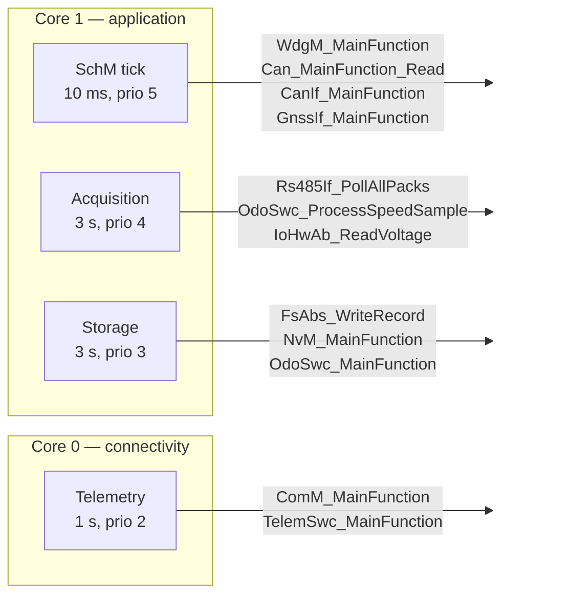
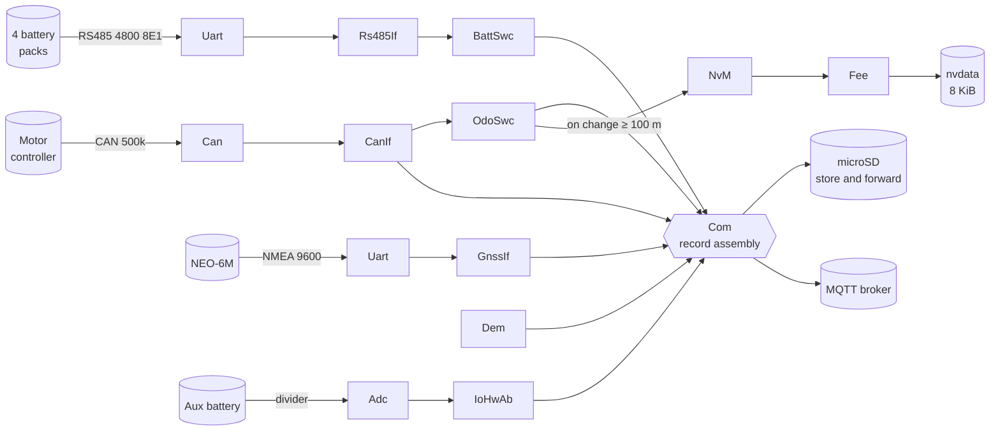
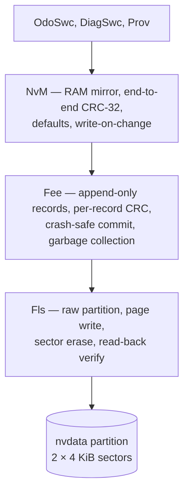
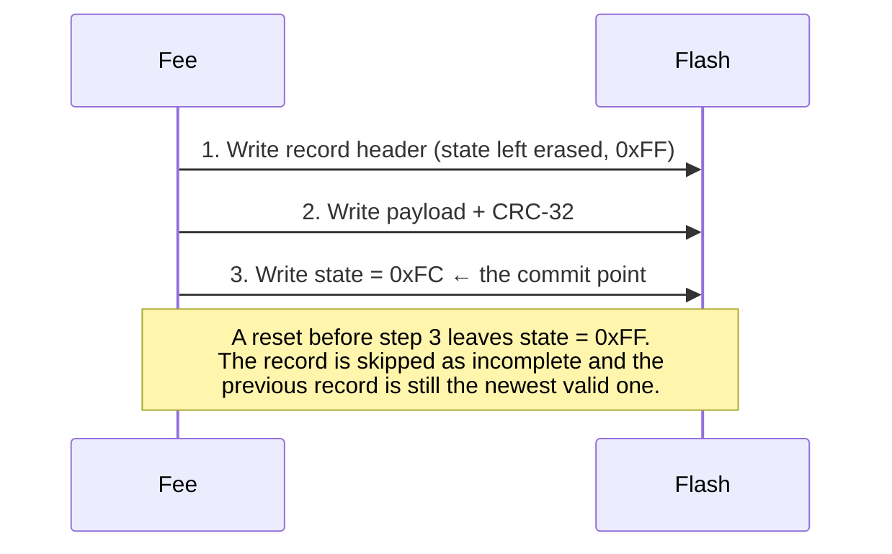
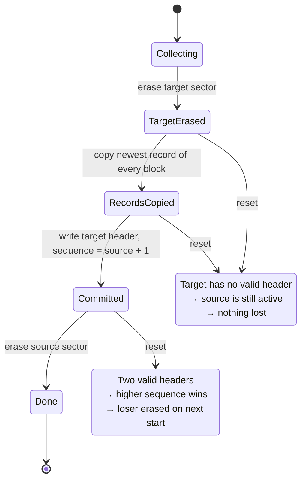
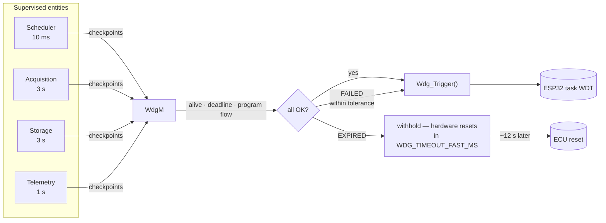

# Software Architecture

**Audience:** embedded engineers joining this project, and reviewers assessing the design.
Assumes familiarity with C and layered embedded architecture; assumes no prior knowledge of
AUTOSAR or of this vehicle.

---

## 1. What this ECU does

> The eight standalone diagrams in [diagrams/](diagrams/) cover this document visually and render
> anywhere. [Layer architecture](diagrams/01-layer-architecture.svg) and
> [Task timing](diagrams/07-task-timing.svg) are the two worth opening beside this page.

A telematics and odometry control unit for a light electric vehicle. Every three seconds it:

- reads motor speed, DC-link voltage and current from the motor controller over CAN
- polls up to four battery packs over a shared RS485 bus (pack voltages, currents, temperatures,
  state of charge, and all 23 cell voltages per pack)
- reads the vehicle position from a GNSS receiver
- measures the auxiliary supply voltage
- integrates motor speed into an odometer reading
- writes one CSV record to an SD card
- publishes that record to an MQTT broker over WiFi or GPRS, whichever is available
- serves historical backfill requests from the broker

It also self-supervises: it maintains a diagnostic trouble-code store that survives power cycles,
supervises its own task execution against a hardware watchdog, and detects its own crash loops.

---

## 2. Why the architecture looks like this

The v1 firmware was a single 719-line `main.cpp` plus twelve loosely-coupled modules that reached
directly for hardware, shared state through a `byte flags[15]` array, and allocated Arduino `String`
objects on every path. It worked, mostly. The problems were not stylistic:

| Symptom | Root cause |
|---|---|
| Odometer reading silently degraded over months | Distance stored as text, read back with `atol()`, which discards the fraction. Truncated value written straight back, so the loss compounded. |
| CAN data never arrived | `init_can()` returned `true` unconditionally with the hardware call commented out. Nothing could detect that the controller was never started. |
| A hung task stalled the logger indefinitely | Watchdog armed but never subscribed to and never petted. |
| Intermittent SD failures on a healthy card | Two devices sharing one SPI bus with no arbitration. |
| A returned unit carried no diagnostic evidence | `flags[15]` was overwritten every cycle and did not survive a reset. |

Every one of these is a **structural** failure: nothing in the code's shape made the fault visible,
and nothing could have caught it without hardware in the loop. The architecture below is chosen so
that each class of fault is either impossible to express or caught by a test that runs on a laptop.

Three decisions do most of the work:

1. **Layering with a hardware boundary.** Only the MCAL touches hardware. Everything above it is
   portable C.
2. **Everything above the MCAL is testable on the host.** Not "testable in principle" — the host
   build compiles *all* `src/**/*.c` against stubs, so a platform dependency leaking upward is a
   link error, immediately.
3. **No dynamic allocation above the MCAL.** Every buffer is caller-supplied or statically sized,
   and every size is justified in a `_Cfg.h` file.

---

## 3. Layer structure

Drawn in full, with every module named and both layering exceptions called out:
[diagrams/01-layer-architecture.svg](diagrams/01-layer-architecture.svg).

```mermaid
flowchart TB
    subgraph APP["Application Layer — software components"]
        direction LR
        ODO["OdoSwc<br/>odometry"]
        BATT["BattSwc<br/>battery monitor"]
        TELEM["TelemSwc<br/>telemetry"]
        DIAG["DiagSwc<br/>diagnostics"]
        HMI["HmiSwc<br/>status indication"]
    end

    subgraph RTE["RTE — runtime environment"]
        RTEBOX["Port interfaces, runnable dispatch,<br/>inter-component data"]
    end

    subgraph SVC["Services Layer — basic software"]
        direction LR
        subgraph SYSSVC["System"]
            ECUM["EcuM"]
            BSWM["BswM"]
            SCHM["SchM"]
        end
        subgraph MEMSVC["Memory"]
            NVM["NvM"]
            FEE["Fee"]
        end
        subgraph COMSVC["Communication"]
            COM["Com"]
            COMM["ComM"]
        end
        subgraph DIAGSVC["Diagnostic"]
            DEM["Dem"]
            DET["Det"]
            WDGM["WdgM"]
        end
        subgraph LIBSVC["Library"]
            CRC["Crc"]
            LOG["Log"]
        end
    end

    subgraph ECUABS["ECU Abstraction Layer"]
        direction LR
        CANIF["CanIf"]
        RS485IF["Rs485If"]
        GNSSIF["GnssIf"]
        NETIF["NetIf"]
        FSABS["FsAbs"]
        TIMEABS["TimeAbs"]
        IOHWAB["IoHwAb"]
    end

    subgraph MCAL["MCAL — Microcontroller Abstraction Layer"]
        direction LR
        MCU["Mcu"]
        PORT["Port"]
        DIO["Dio"]
        ADC["Adc"]
        SPI["Spi"]
        CAN["Can"]
        UART["Uart"]
        GPT["Gpt"]
        WDG["Wdg"]
        FLS["Fls"]
    end

    HW[["Hardware — ESP32, MCP2515, MAX3485,<br/>DS3231, microSD, SIM800L, NEO-6M"]]

    APP --> RTE
    RTE --> SVC
    SVC --> ECUABS
    ECUABS --> MCAL
    MCAL --> HW

    SVC -.->|"Crc, Det available<br/>to every layer"| MCAL
```



### Layer responsibilities and the rule each enforces

| Layer | Owns | May depend on | May **not** |
|---|---|---|---|
| **MCAL** | Register access, peripheral configuration | The chip, `Std_Types`, `Det` | Know why anything is being read |
| **ECU Abstraction** | Wire protocols, device semantics, unit conversion | MCAL, `Crc`, `Det`, `Dem` | Know what the data is used for |
| **Services** | Persistence, diagnostics, scheduling, supervision | ECU Abstraction, MCAL | Contain vehicle logic |
| **RTE** | Connecting components, dispatching runnables | Services | Contain any logic of its own |
| **Application** | Vehicle behaviour — odometry, telemetry content | RTE only | Touch a driver directly |

The one deliberate exception: `Det` and `Crc` are callable from every layer, including the MCAL.
`Det` because an error reporter that cannot be called from the layer where errors occur is useless,
and `Crc` because it is a pure function with no state and no dependencies.

---

## 4. The MCAL split, and why it matters

Each MCAL module is divided in two:

```
src/mcal/Gpt/
  Gpt.h            interface, used by everything above
  Gpt.c            platform-independent part  — compiled on host AND target
  Gpt_Esp32.cpp    platform leaf              — compiled on target only
test/support/
  Stub_Mcal.c      platform leaf for the host — compiled on host only
```

This is not a cosmetic split. It decides what is *actually* tested:

- `Gpt.c` holds the wrap-safe elapsed-time arithmetic. That is the part with a bug in it if anything
  is — a 32-bit millisecond counter wraps every 49.7 days — so it is the part that must be real code
  under test, not a mock.
- `Gpt_Esp32.cpp` holds `esp_timer_get_time()`. There is nothing to test there.

The same reasoning applies throughout: `Adc.c` holds the oversampling and outlier trimming;
`Uart.c` holds the bounded exact-length read with its early exit; `Mcu.c` holds the device-ID
formatting. The platform leaves are as close to trivial as they can be made.

**`Can` is fully platform-independent.** The MCP2515 is an external SPI device, so the driver talks
only to `Spi`, `Dio` and `Gpt`. Its entire register protocol and its 29-bit identifier codec are
therefore verified off-target against a scripted SPI stub — which is the only practical way to gain
confidence in a register sequence without a logic analyser permanently attached.

---

## 5. Task and scheduling model

Drawn to scale over one 3-second period, with the budgets and core split:
[diagrams/07-task-timing.svg](diagrams/07-task-timing.svg).

Four FreeRTOS tasks, all created once at startup, none created afterwards. No task is ever deleted.



**Connectivity is pinned to core 0** because the ESP32 WiFi and Bluetooth stacks run there. Putting
the telemetry task on the same core as the radio avoids cross-core contention on the lwIP locks;
putting acquisition on core 1 keeps the radio's unpredictable latency away from the RS485 timing.

**Why fixed cyclic tasks rather than event-driven.** This ECU's work is periodic by nature — a
sample every three seconds — and a fixed schedule gives a bounded worst-case execution time per
slot, which is what `WdgM`'s deadline supervision needs in order to mean anything. An event-driven
design would make "this runnable is late" undefinable.

### The v1 scheduling problem

v1's acquisition task had a nominal 3 s period, and inside it:

- a blocking `delay(1000)` after every GNSS read
- up to three RS485 exchanges per pack, each with a 1 s timeout and **no early exit**
- four packs

That is up to 13 seconds of blocking work inside a 3-second period. The task ran permanently late,
`vTaskDelayUntil` could never catch up, and every distance calculation that assumed a 3-second
interval was wrong by the overrun. The fixes are structural: `Uart_ReadExact` returns the instant
the last byte lands, RS485 timeouts are derived from frame length rather than fixed at a second, and
the odometer integrates over *measured* elapsed time so it stays correct even when a cycle does run
long.

---

## 6. Startup sequence

As a decision flow, showing which failures rejoin the main path and which two do not:
[diagrams/02-startup-flow.svg](diagrams/02-startup-flow.svg).

```mermaid
sequenceDiagram
    autonumber
    participant M as main()
    participant E as EcuM
    participant MC as MCAL
    participant S as Services
    participant A as Application
    participant W as WdgM

    M->>E: EcuM_Init()
    E->>MC: Mcu_Init() — latch reset cause first
    Note over E,MC: Reset cause must be read before<br/>anything can overwrite it
    E->>S: Det_Init() — before anything that may report
    E->>MC: Port_Init(), Gpt_Init(), Dio_Init()
    E->>W: WdgM_Init() — armed SLOW; startup blocks legitimately
    E->>S: Dem_Init()
    E->>MC: Fls_Init()
    E->>S: Fee_Init() → NvM_Init()
    Note over S: A block that is absent or fails its CRC<br/>falls back to a compiled-in default
    E->>E: Check crash-loop counter
    alt Crash loop detected
        E->>S: Raise DEM_EVENT_CRASH_LOOP
        E->>E: Enter degraded mode — skip the subsystem that keeps failing
    end
    E->>MC: Spi_Init(), Adc_Init(), Uart_Init()
    E->>MC: Can_Init()
    alt CAN init fails
        E->>S: Raise DEM_EVENT_CAN_INIT_FAILED
        Note over E: Continue without CAN. Battery, GNSS and<br/>voltage data are still worth logging.<br/>v1 called ESP.restart() here — a reboot loop.
    end
    E->>A: Rs485If_Init() → Rs485If_DiscoverPacks()
    E->>A: GnssIf_Init(), FsAbs_Init(), TimeAbs_Init()
    E->>A: OdoSwc_Init(), BattSwc_Init(), TelemSwc_Init(), HmiSwc_Init()
    E->>S: SchM_Init() — create the four tasks
    E->>W: WdgM_ActivateSupervision() — switch to FAST
    Note over W: Only now that the cyclic tasks really run.<br/>Switching earlier resets a unit that is<br/>merely starting up slowly.
    E->>S: Dem_StartOperationCycle()
```

The ordering constraints that are not obvious:

- **`Mcu_Init` is first.** It latches the reset cause, which is the input to crash-loop detection.
- **`Det_Init` is second.** Any module's `Init` may report a contract violation, and a report before
  `Det_Init` is only counted, not recorded with its detail.
- **`WdgM_Init` before the long blocking work, in SLOW mode.** SD mount, GPRS attach and the first
  broker handshake legitimately take tens of seconds.
- **`WdgM_ActivateSupervision` last.** Entities start deactivated; activating them before their
  tasks exist would have every one report an alive violation on the first cycle.

---

## 7. Data flow for one acquisition cycle

Drawn across all five layers, including the store-before-send ordering:
[diagrams/03-acquisition-dataflow.svg](diagrams/03-acquisition-dataflow.svg). The odometry branch is
expanded in [diagrams/04-odometry-flow.svg](diagrams/04-odometry-flow.svg), and the publish side in
[diagrams/08-store-and-forward.svg](diagrams/08-store-and-forward.svg).



Note what is **not** in that diagram: no component reads a driver directly, and the odometer's path
to durable storage goes through two layers that each add an independent integrity check.

---

## 8. The persistence stack

Where a power loss lands at each step of a write:
[diagrams/05-crash-safe-commit.svg](diagrams/05-crash-safe-commit.svg).

This is where v1 lost data, so it gets three layers rather than one.



### The guarantee

> After a supply loss at **any** instant during a write, the next boot reads either the new value or
> the previous one. Never a blend, and never nothing.

NOR flash cannot rewrite a byte in place. `Fee` therefore treats a block update as a new
**append-only record**, and the newest valid record is the current value. A record is committed by a
single write that clears bits in a one-byte state field, *after* both its header and payload are on
the media:



Garbage collection is crash-safe by the same reasoning, with the sector header as the commit point:



At no point is there a window in which neither sector holds the data. Both recovery paths are
covered by tests that inject a write failure at exactly the relevant address.

### Wear

| Quantity | Value | Where it comes from |
|---|---|---|
| Odometer record size | 64 B | 48 B payload + 16 B header |
| Records per 4 KiB sector | 63 | (4096 − 16) / 64 |
| Erases per garbage collection | 2 | target before copy, source after |
| Persist threshold | 100 m | `ODO_PERSIST_DISTANCE_MM` |
| Records/day at 30 km/h, 10 h/day | 3000 | 300 per hour |
| Erases/day | ~96 | 3000 / 63 × 2 |
| Endurance | 100 000 cycles | flash datasheet |
| **Service life at that duty** | **~1000 days** | and that duty cycle is an extreme |

A parked vehicle accumulates no distance, so `NvM`'s write-on-change comparison suppresses the write
entirely — a stationary vehicle costs zero flash wear, however long it idles. That is asserted by a
test.

---

## 9. Supervision



Three kinds of check, because a hardware watchdog alone detects only one failure — everything
stopping:

| Check | Catches | Which the others miss |
|---|---|---|
| **Alive** — check-ins per cycle within bounds | A stalling runnable, *and* a runaway one | A runaway task starves the others; the symptom points away from the cause |
| **Deadline** — gap between two check-ins | A single long stall | An averaged count hides an 8 s stall completely |
| **Program flow** — checkpoint ordering | A runnable that returned through an unintended branch | Neither of the above notices at all |

A FAILED entity still gets the watchdog petted; one missed deadline must not reset a vehicle's data
logger. Only exhausting the tolerance withholds it. The resulting ~12 s delay before the hardware
bites is deliberate: it gives the telemetry task one last chance to publish *which* entity expired,
so the reset reaches the fleet as a diagnosis rather than an unexplained gap in the data.

---

## 10. Degraded operation

The ECU is a data logger on a vehicle with no service connection. Almost every subsystem failure
should reduce what it records, not stop it recording.

| Failed subsystem | Behaviour |
|---|---|
| CAN controller | No RPM, so no odometry. Battery, GNSS, voltage still logged. DTC raised. |
| One battery pack | That pack's fields are blank (**not zero**). Other packs unaffected. |
| All battery packs | Vehicle-level data still logged. DTC raised, driver warned. |
| GNSS receiver | Position fields blank. Everything else unaffected. |
| SD card | Live publish continues; no store-and-forward buffer. DTC raised, driver warned. |
| Both backhauls | Records accumulate on SD and are transferred when a bearer returns. |
| RTC | Records carry monotonic uptime but a blank wall-clock field, so they remain orderable. |
| NV block corrupt | Configured default applied; DTC raised. |
| Crash loop detected | The subsystem that keeps failing is skipped on the next start. |

The recurring principle: **an unavailable measurement is emitted as an empty field, never as zero.**
v1 emitted zeros and blanks interchangeably, so a pack that had stopped answering was
indistinguishable in the log from one genuinely reading 0 V — and anything computing a fleet average
over that column is wrong in a way nobody notices.

---

## 11. Deliberate deviations from AUTOSAR

AUTOSAR Classic assumes a code-generation toolchain, an OSEK/AUTOSAR OS, and an ECU with a formal
role in a vehicle network. This is a single aftermarket telematics unit on an ESP32 running
FreeRTOS. The conventions worth keeping are kept; the ones that would be ceremony are not, and each
omission is recorded rather than left for a reader to wonder about.

| AUTOSAR element | Status | Reason |
|---|---|---|
| `Std_ReturnType`, `Std_VersionInfoType`, module/API/instance IDs | **Adopted** | A captured error code is decodable offline from one registry |
| Layering and the MCAL boundary | **Adopted** | The whole testability argument rests on it |
| `Det` development error tracing | **Adopted**, and left enabled in production | See [ADR-0004](adr/0004-keep-det-enabled-in-production.md) |
| `Dem` events, UDS status byte, debouncing, snapshots | **Adopted** | Field diagnosis needs all of it |
| `WdgM` alive/deadline/program-flow supervision | **Adopted** | The v1 watchdog protected nothing |
| `NvM` / `Fee` block model | **Adopted** | This is where v1 lost data |
| Pre-compile `_Cfg.h` configuration | **Adopted** | Every constant gets a justification next to it |
| `MemIf` | **Omitted** | It dispatches between `Fee` and `Ea`. There is only `Fee`, so it would be an empty indirection. [ADR-0003](adr/0003-omit-memif.md) |
| ARXML and generated RTE | **Omitted** | The RTE is hand-written and small. Generation needs a toolchain this project does not have, and would obscure rather than clarify. [ADR-0002](adr/0002-handwritten-rte.md) |
| AUTOSAR OS (OSEK) | **Omitted** | FreeRTOS is what the ESP-IDF provides. `SchM` presents the fixed-cyclic model AUTOSAR assumes, on top of it. |
| `CanTp`, `PduR`, `Com` signal routing | **Reduced** | Two CAN frames, no transport protocol, no gateway. A full PDU router would be pure overhead. |
| `Dcm` / full UDS | **Reduced** | A subset over MQTT: read DTCs, read snapshots, clear, read/write calibration. No ISO-TP, no security access. |
| MISRA C:2012 full compliance | **Partial** | Checked with `cppcheck --addon=misra`; advisory rules on fixed-width arithmetic are deviated with justification in [docs/10-coding-standard.md](10-coding-standard.md). |

---

## 12. Where the risk is

An honest assessment of what is well covered and what is not.

**Well covered — 333 host tests, including fault injection:**
CRC (all six profiles, exhaustive single-bit detection), the MCP2515 register protocol and
identifier codec, the RS485 frame codec and transport, flash EEPROM emulation including power-fail
at the commit byte / mid-payload / mid-garbage-collection, the odometer's integration and
persistence, the NMEA parser, DTC debouncing and healing, watchdog supervision, and the CSV/chunking
serialisation.

**Not covered by automated test, and why:**

| Area | Why not | Mitigation |
|---|---|---|
| ESP32 platform leaves (`*_Esp32.cpp`) | They are the hardware boundary; testing them means testing the silicon | Kept as thin as possible, no logic |
| WiFi / GPRS / MQTT stacks | Third-party, network-dependent | Isolated behind `NetIf`; failures are `Dem` events, not crashes |
| Real SD card timing and wear | Needs the physical card | `FsAbs` bounds every operation; `WdgM` deadlines sized from observed stalls |
| Concurrency between the four tasks | Host tests are single-threaded | Shared state is confined to single-producer/single-consumer rings and the SPI lock; documented per module |
| RS485 field scaling | **Unconfirmed** — see [docs/08-protocols.md](08-protocols.md) | Raw integers are logged, so a later correction can be applied retrospectively |
| CAN frame byte order | **Unconfirmed** — v1's comment and code disagreed | Code behaviour adopted; behind a one-line switch |

The two "unconfirmed" rows are the genuine open items. Both are recorded in the protocol document
with what would settle them, and in both cases the design stores the raw value so that a correction
does not invalidate data already collected.

---

## 13. Reading order for a new engineer

1. [diagrams/](diagrams/) — diagrams 1, 2 and 7, which give the shape before any of the detail
2. [`config/Ecu_PinMap.h`](../config/Ecu_PinMap.h) — the hardware contract, and the three v1 pin
   conflicts it resolves
3. [`src/base/Std_Types.h`](../src/base/Std_Types.h) — the vocabulary every module uses
4. [`src/services/Fee/Fee.h`](../src/services/Fee/Fee.h) — the crash-safety argument, written out
5. [`src/app/OdoSwc/OdoSwc.h`](../src/app/OdoSwc/OdoSwc.h) — the product's core function
6. [`test/test_fee/test_fee.c`](../test/test_fee/test_fee.c) — what a power-fail test looks like
7. [docs/01-requirements.md](01-requirements.md) → [docs/04-safety-analysis.md](04-safety-analysis.md)

---

## See also

- [Diagrams](diagrams/) — the eight standalone SVGs
- [01 — Requirements](01-requirements.md)
- [03 — Module interfaces](03-interfaces.md)
- [04 — Safety analysis](04-safety-analysis.md)
- [05 — Test strategy](05-test-strategy.md)
- [06 — Traceability](06-traceability.md)
- [07 — Hardware](07-hardware.md)
- [08 — Protocols](08-protocols.md)
- [09 — Operations](09-operations.md)
- [10 — Coding standard](10-coding-standard.md)
- [Architecture decision records](adr/)
