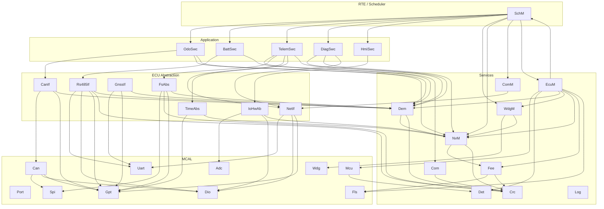
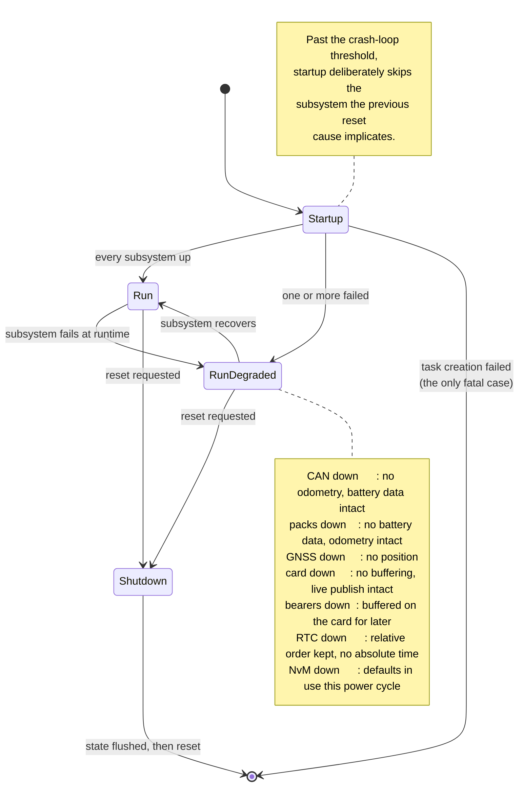

# Diagrams

**Audience:** anyone editing a diagram, or wondering why one is in the format it is in.

---

## Format, and why each

| Format | Used for | Why |
|---|---|---|
| **Mermaid**, inline in the document | Layer structure, state machines, sequences, flow | Renders on GitHub, diffs as text, and edits without a tool. A structural diagram's value is that it stays correct, and one that needs a licensed editor stops being updated. |
| **SVG**, hand-written | The schematic, the board interconnect | Spatial layout that Mermaid cannot express. Hand-written rather than exported, so it diffs meaningfully and has no binary provenance. |
| **ASCII**, inline | Small bus topologies, byte layouts, timing | Legible in a terminal, in a code comment, and in a `git log`. A 12-line ASCII bus diagram beats a 40 KB image for the same content. |

Nothing here is a binary export. A `.png` of a diagram whose source lives elsewhere is a diagram that
will be wrong within two releases, because updating it requires finding the source first.

---

## Where each diagram lives

Diagrams are **in** the document that explains them, not collected here. A layer diagram three clicks
away from its explanation is a diagram nobody looks at while reading.

| Diagram | Location |
|---|---|
| Layer structure | [02-architecture.md](../02-architecture.md) §3 |
| Task model and scheduling | [02-architecture.md](../02-architecture.md) §5 |
| Startup sequence | [02-architecture.md](../02-architecture.md) §6 |
| Data flow, acquisition to publish | [02-architecture.md](../02-architecture.md) §7 |
| Persistence stack and commit points | [02-architecture.md](../02-architecture.md) §8 |
| Supervision | [02-architecture.md](../02-architecture.md) §10 |
| Board interconnect | [hardware/schematic.svg](../hardware/schematic.svg) |
| Shared SPI bus | [07-hardware.md](../07-hardware.md) §4 |
| RS485 bus and turnaround timing | [07-hardware.md](../07-hardware.md) §7, [08-protocols.md](../08-protocols.md) §1 |
| MCP2515 identifier bit layout | [08-protocols.md](../08-protocols.md) §2 |
| NMEA sentence anatomy | [08-protocols.md](../08-protocols.md) §3 |

This file holds only the reference diagrams below, which no single document owns.

---

## Module dependency graph

Every edge in the system, so a layer violation is visible as an edge pointing the wrong way. Arrows
point from caller to callee.

**The two exceptions visible above**, both deliberate and both in
[03-interfaces.md](../03-interfaces.md) §2:

- `Mcu → Det`, an MCAL module calling a service. A driver that detects a contract violation and cannot
  report it must either ignore it or invent a return path for something the caller cannot act on.
  AUTOSAR permits this, and Det is built for it — no dependencies of its own, and functional before its
  own `Init`.
- `CanIf → Dem`, `Rs485If → Dem`, ECU abstraction calling services. Same reasoning: routing a
  diagnostic event up through the RTE and back down adds indirection whose only purpose is to satisfy
  the diagram.

What the graph shows is as important as what it contains: **no arrow points upward**, and no
application component calls another. Composition is `SchM`'s job.

---

## Degraded-mode transitions

What happens when a subsystem fails, and what is lost at each step. The design principle is that a
failure reduces what is recorded rather than stopping recording.

`EcuM_Init` returns `E_NOT_OK` for exactly one condition — a task could not be created — because that is
the only failure with nothing to degrade to. Everything else raises a diagnostic event and continues.

---

## Editing these

Mermaid renders directly on GitHub; no build step. Check a change by previewing the Markdown.

For the SVG, edit the text. It is written to be edited: classes at the top for every style, net names
matching `config/Ecu_PinMap.h` exactly so a signal traces from drawing to code without a translation
step, and the notes numbered to the conflicts in [07-hardware.md](../07-hardware.md) §3.

If you change a pin assignment, `config/Ecu_PinMap.h` is authoritative and the drawing follows. That
file fails the build on a conflict; the drawing cannot.
