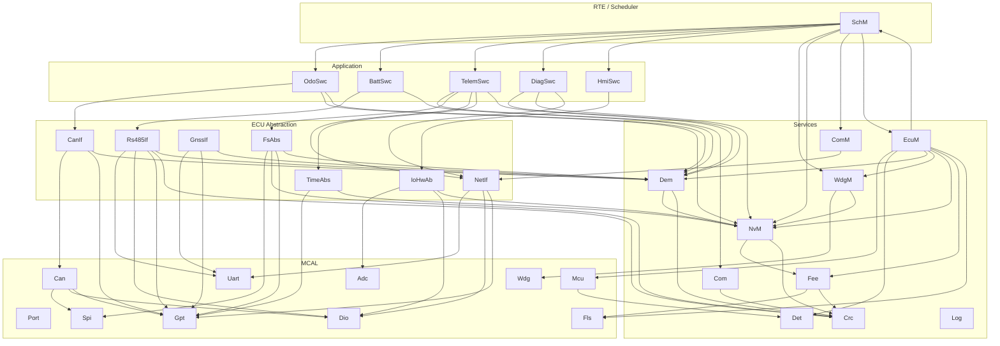
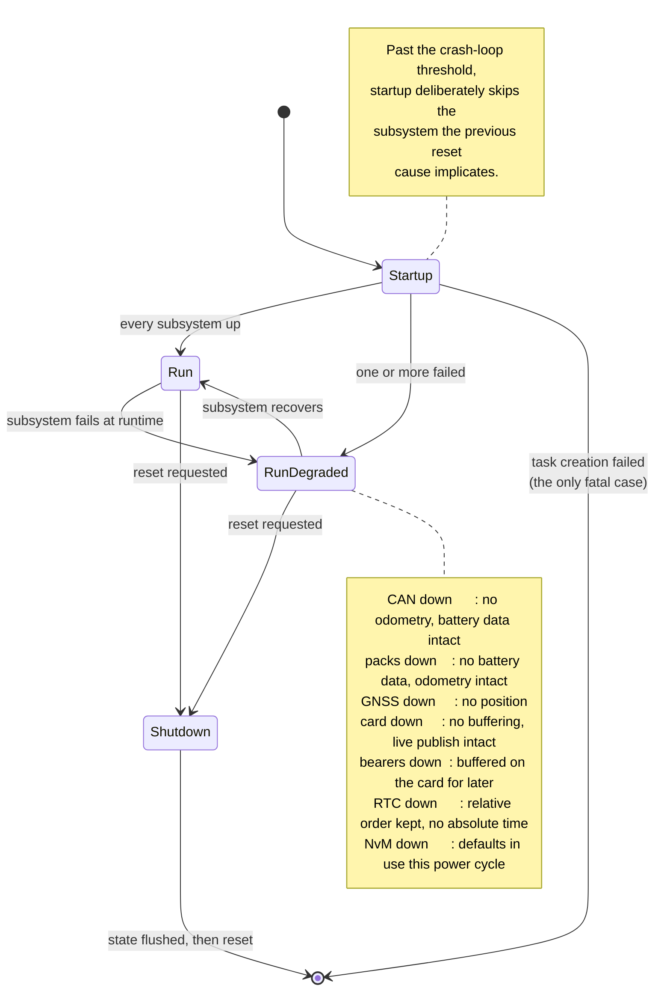

# Diagrams

**Audience:** anyone reading the design for the first time, editing a diagram, or wondering why one is
in the format it is in.

---

## 1. The diagram set

Eight standalone SVGs. Each opens in any browser with no plugin and no build step, and each is
hand-written text, so it diffs line by line and can be corrected in place.

| # | Diagram | What it answers |
|---|---|---|
| 1 | [Layer architecture](01-layer-architecture.svg) | What the layers are, which module sits in which, and where the two deliberate exceptions to strict layering are. |
| 2 | [Startup flow](02-startup-flow.svg) | What `EcuM_Init` does in what order, which failures are survivable, and which two are not. |
| 3 | [Acquisition data flow](03-acquisition-dataflow.svg) | How a sensor reading becomes a field in a 199-column record, and where the store-before-send ordering is enforced. |
| 4 | [Odometry](04-odometry-flow.svg) | How one speed sample becomes accumulated distance, why every gate is there, and where the integer arithmetic comes from. |
| 5 | [Crash-safe commit](05-crash-safe-commit.svg) | Where a power loss can land during a write, and why no instant leaves neither value readable. |
| 6 | [Bearer arbitration](06-bearer-arbitration.svg) | How WiFi and GPRS are chosen between, and the decay that keeps a fallback from becoming permanent. |
| 7 | [Task timing](07-task-timing.svg) | The four tasks to scale over one period — periods, budgets, priorities, core assignment, and what each priority protects. |
| 8 | [Store and forward](08-store-and-forward.svg) | How the card acts as the queue, how the send cursor survives a reset, and how the backlog crosses a date boundary. |

Diagrams 4, 5, 6 and 8 each carry a note panel describing a **defect the diagram's subject actually
had**, found by a test rather than by review. They are in the drawings because the shape of the fix is
easier to see than to describe: a missing transition is visible in a state machine and invisible in a
diff.

### Reading order

If you are new to the system: **1** for the shape, **2** for how it comes up, **7** for how it runs,
then **3** for what it does once running. **4**, **5**, **6** and **8** are the four subsystems worth
understanding in detail, in any order.

---

## 2. Format, and why each

| Format | Used for | Why |
|---|---|---|
| **SVG**, hand-written | The eight diagrams above, and the schematic | Renders in every browser, every IDE preview and GitHub, with no plugin. Diffs as text. Positions are explicit, so a correction is a number, not a re-export. |
| **Mermaid**, inline in the document | The two reference graphs below, and small structural diagrams inside documents | Edits without a tool and sits next to the prose it belongs to. Best where the content *is* a graph and the layout does not matter. |
| **ASCII**, inline | Small bus topologies, byte layouts, turnaround timing | Legible in a terminal, in a code comment, and in a `git log`. A 12-line ASCII bus diagram beats a 40 KB image for the same content. |

Nothing here is a binary export. A `.png` of a diagram whose source lives elsewhere is a diagram that
will be wrong within two releases, because updating it requires finding the source first.

---

## 3. Diagrams that live inside a document

These are Mermaid or ASCII, inline, because they belong beside the paragraph that explains them. A
structural diagram three clicks from its explanation is one nobody looks at while reading.

| Diagram | Location |
|---|---|
| Layer structure, in prose form | [02-architecture.md](../02-architecture.md) §3 |
| Task model and scheduling | [02-architecture.md](../02-architecture.md) §5 |
| Startup sequence | [02-architecture.md](../02-architecture.md) §6 |
| Data flow, acquisition to publish | [02-architecture.md](../02-architecture.md) §7 |
| Persistence stack and commit points | [02-architecture.md](../02-architecture.md) §8 |
| Supervision | [02-architecture.md](../02-architecture.md) §10 |
| Board interconnect | [hardware/schematic.svg](../hardware/schematic.svg) |
| Shared SPI bus | [07-hardware.md](../07-hardware.md) §4 |
| RS485 bus and turnaround timing | [07-hardware.md](../07-hardware.md) §7, [08-protocols.md](../08-protocols.md) §1 |
| MCP2515 identifier bit layout | [08-protocols.md](../08-protocols.md) §2 |
| NMEA sentence anatomy | [08-protocols.md](../08-protocols.md) §3 |

---

## 4. Module dependency graph

Every edge in the system, so a layer violation is visible as an edge pointing the wrong way. Arrows
point from caller to callee. Kept as Mermaid rather than drawn by hand: it is exactly a graph, the
layout carries no meaning, and an auto-layout that shifts when an edge is added is the correct
behaviour here.



**The two exceptions visible above**, both deliberate, both drawn in the footer panel of
[diagram 1](01-layer-architecture.svg) and both recorded in [03-interfaces.md](../03-interfaces.md) §2:

- `Mcu → Det`, an MCAL module calling a service. A driver that detects a contract violation and cannot
  report it must either ignore it or invent a return path for something the caller cannot act on.
  AUTOSAR permits this, and Det is built for it — no dependencies of its own, and functional before its
  own `Init`.
- `CanIf → Dem`, `Rs485If → Dem`, ECU abstraction calling services. Same reasoning: routing a
  diagnostic event up through the RTE and back down adds indirection whose only purpose is to satisfy
  the diagram.

What the graph shows is as important as what it contains: **no arrow points upward**, and no
application component calls another. Composition is `SchM`'s job.

---

## 5. Degraded-mode transitions

What happens when a subsystem fails, and what is lost at each step. The design principle is that a
failure reduces what is recorded rather than stopping recording. The startup half of this is drawn to
scale in [diagram 2](02-startup-flow.svg); this is the runtime half.



`EcuM_Init` returns `E_NOT_OK` for exactly one condition — a task could not be created — because that is
the only failure with nothing to degrade to. Everything else raises a diagnostic event and continues.

---

## 6. Editing these

### The SVGs

Edit the text. They are written to be edited:

- Every style is a class in the `<style>` block at the top, so a colour or a font size changes in one
  place. The palette is shared across all eight: MCAL red, ECU abstraction amber, services green, RTE
  purple, application blue, and it matches diagram 1's layer colours everywhere.
- Coordinates are plain numbers with no transforms, so moving a box is arithmetic, not a matrix.
- Where a diagram is to scale, the mapping is stated in a comment — diagram 7 notes its 0.30667 px/ms,
  so a new bar is computed rather than eyeballed.
- The opening comment on each file says what the diagram is *for*, which is the thing to preserve if
  the drawing is reorganised.

After editing, confirm the file is still well-formed before committing:

```bash
python -c "import xml.dom.minidom, glob; [xml.dom.minidom.parse(f) for f in glob.glob('docs/diagrams/*.svg')]"
```

An unclosed tag or an undefined `url(#id)` reference is easy to introduce and renders as a silently
missing element rather than an error.

**Numbers in these diagrams come from the code, not from memory.** Every period, budget, timeout and
threshold drawn here is in a `*_Cfg.h`. If you change one, the diagram is now wrong; grep the diagram
set for the old value.

### The schematic

[hardware/schematic.svg](../hardware/schematic.svg) follows the same conventions, with net names
matching `config/Ecu_PinMap.h` exactly so a signal traces from drawing to code without a translation
step, and notes numbered to the conflicts in [07-hardware.md](../07-hardware.md) §3.

If you change a pin assignment, `config/Ecu_PinMap.h` is authoritative and the drawing follows. That
file fails the build on a conflict; the drawing cannot.

### The Mermaid graphs

They render directly on GitHub with no build step. Check a change by previewing the Markdown.
